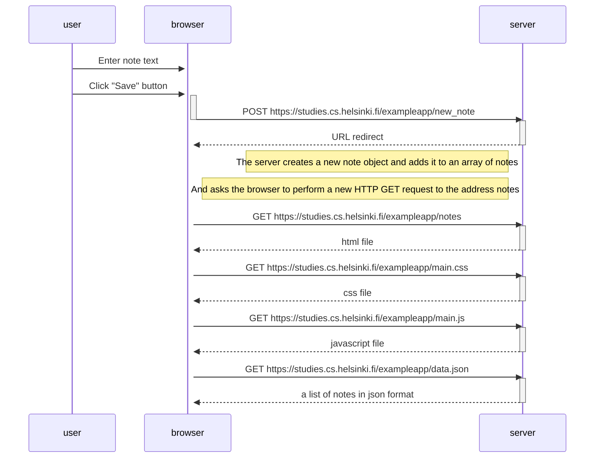

```mermaid
sequenceDiagram
    participant user
    participant browser
    participant server

    user->>+browser: Enter note text
    user->>+browser: Click "Save" button
    activate browser

    browser->>server: POST https://studies.cs.helsinki.fi/exampleapp/new_note
    deactivate browser
    activate server
    server-->>browser: URL redirect
    deactivate server
    Note left of server: The server creates a new note object and adds it to an array of notes 
    Note left of server: And asks the browser to perform a new HTTP GET request to the address notes 

    browser->>server: GET https://studies.cs.helsinki.fi/exampleapp/notes
    activate server
    server-->>browser: html file
    deactivate server

    browser->>server: GET https://studies.cs.helsinki.fi/exampleapp/main.css
    activate server
    server-->>browser: css file
    deactivate server

    browser->>server: GET https://studies.cs.helsinki.fi/exampleapp/main.js
    activate server
    server-->>browser: javascript file
    deactivate server

    browser->>server: GET https://studies.cs.helsinki.fi/exampleapp/data.json
    activate server
    server-->>browser: a list of notes in json format
    deactivate server
```