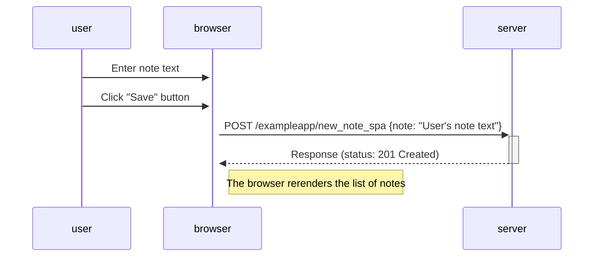

```mermaid
sequenceDiagram
    participant user
    participant browser
    participant server

    user->>+browser: Enter note text
    user->>+browser: Click "Save" button
    browser->>+server: POST /exampleapp/new_note_spa {note: "User's note text"}
    activate server
    server-->>-browser: Response (status: 201 Created)
    deactivate server
    Note right of browser: The browser rerenders the list of notes
```