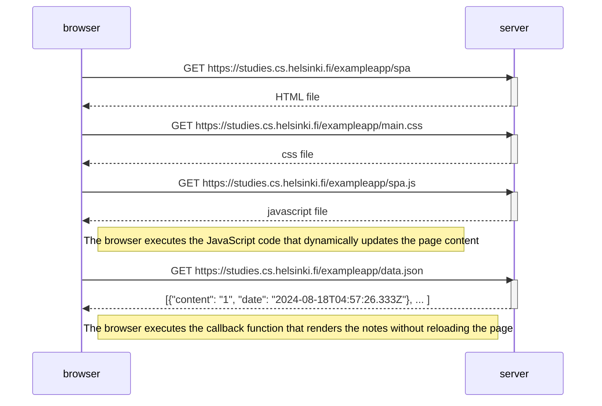

```mermaid
sequenceDiagram
    participant browser
    participant server

    browser->>server: GET https://studies.cs.helsinki.fi/exampleapp/spa
    activate server
    server-->>browser: HTML file
    deactivate server

    browser->>server: GET https://studies.cs.helsinki.fi/exampleapp/main.css
    activate server
    server-->>browser: css file
    deactivate server

    browser->>server: GET https://studies.cs.helsinki.fi/exampleapp/spa.js
    activate server
    server-->>browser: javascript file
    deactivate server

    Note right of browser: The browser executes the JavaScript code that dynamically updates the page content

    browser->>server: GET https://studies.cs.helsinki.fi/exampleapp/data.json
    activate server
    server-->>browser: [{"content": "1", "date": "2024-08-18T04:57:26.333Z"}, ... ]
    deactivate server

    Note right of browser: The browser executes the callback function that renders the notes without reloading the page
```